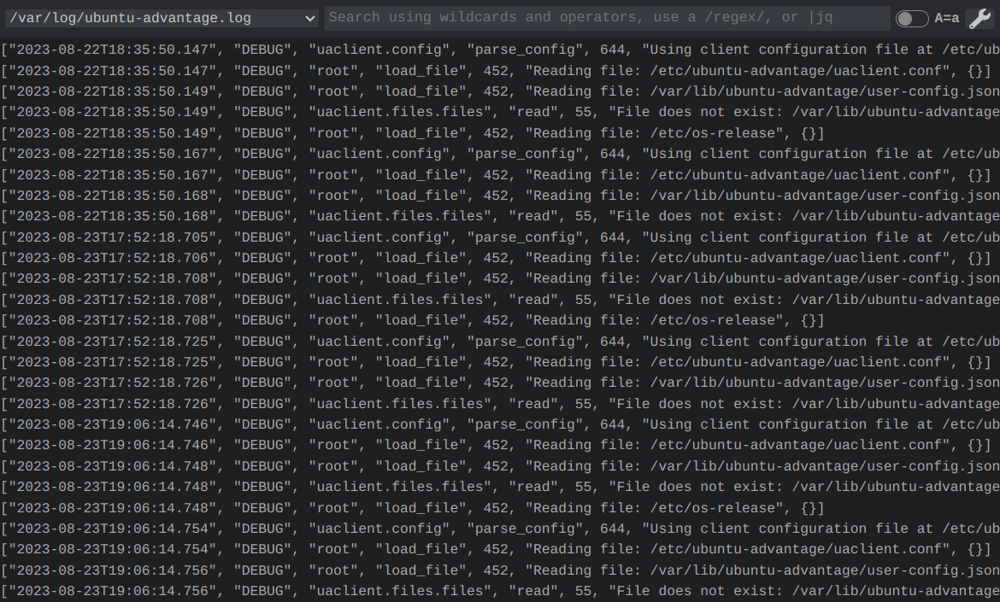
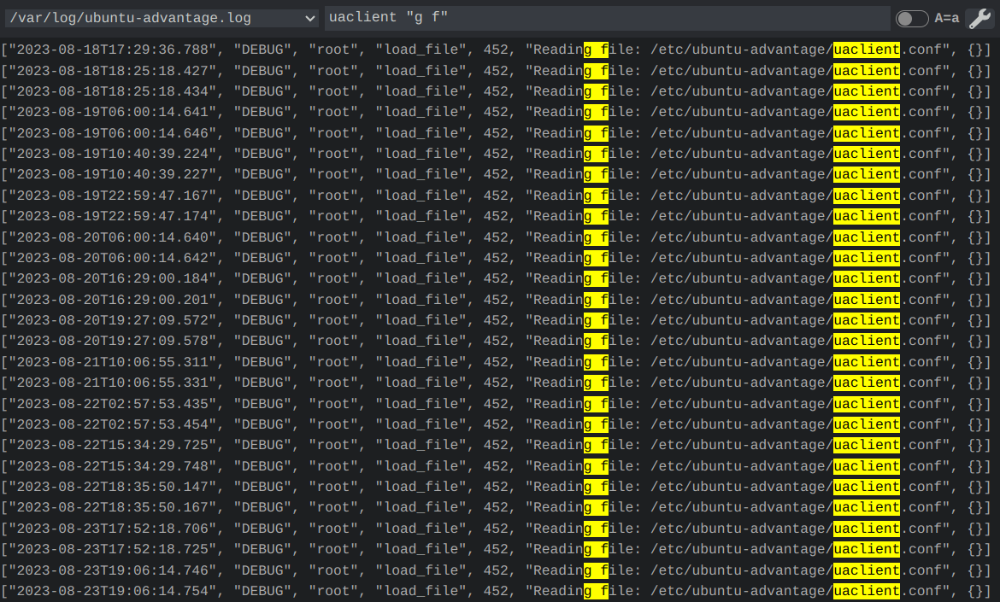
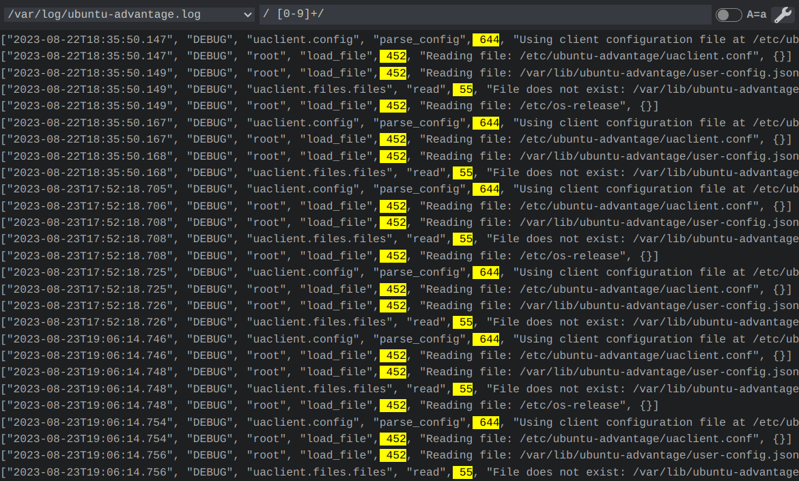
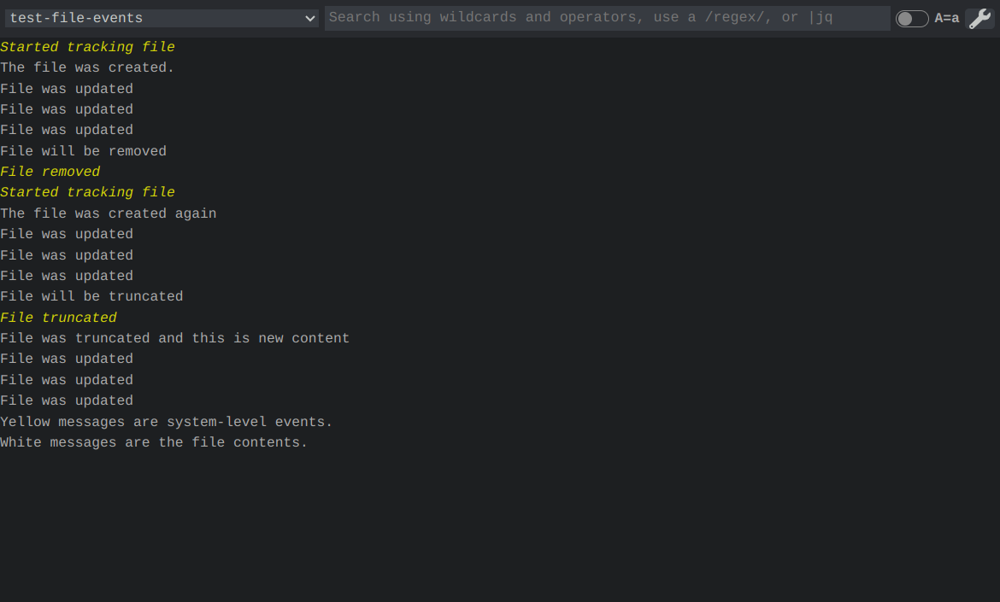
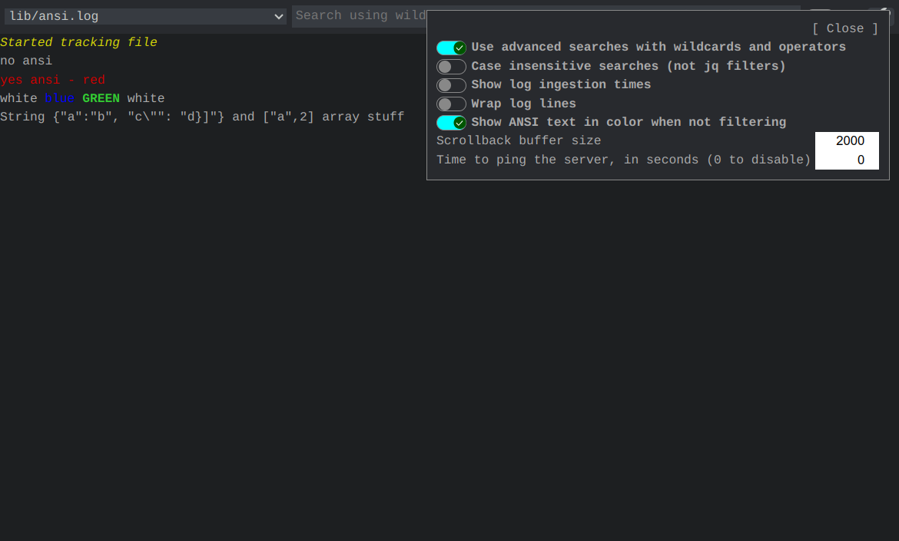
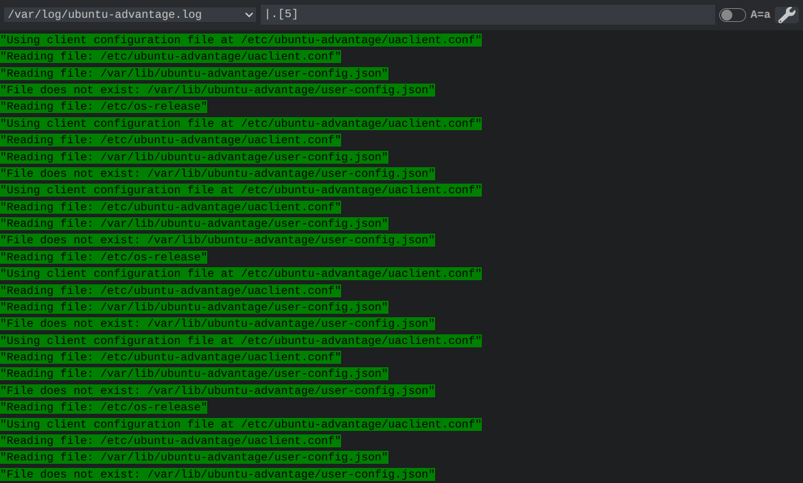
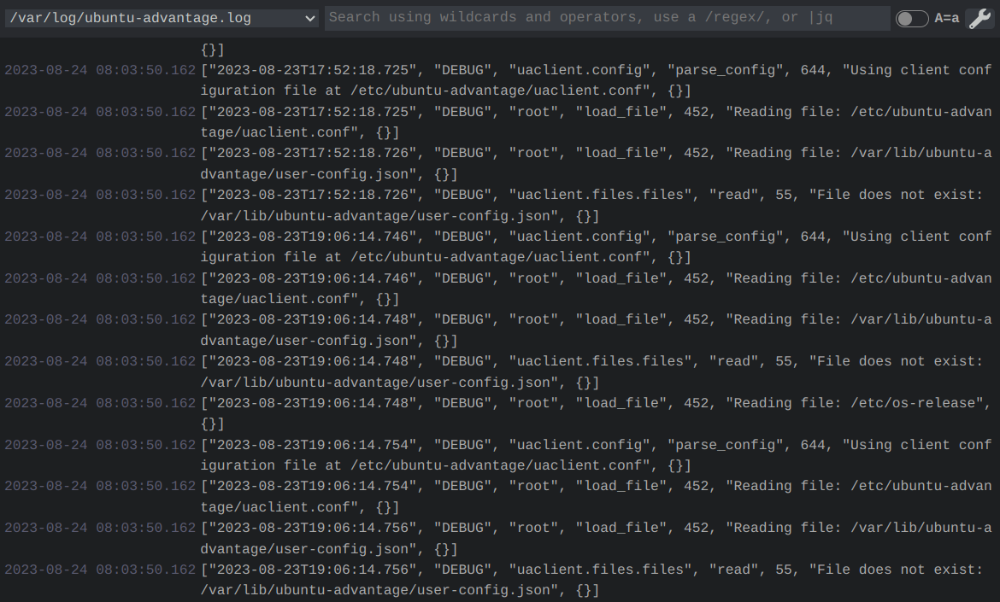

# Log Viewer

This is a simple tool to follow multiple log files in a browser. By pointing the script at a series of paths or globs, you are able to then serve these files to your browser. When you load the page, the logs are searchable and a history is kept when toggling between different files.

This is a quick and easy method to allow people to view logs without granting them the permission to execute commands on a server.

## API Features

* Monitors globs for new files and will automatically start following them.
* Preserves a number of lines and sends them to connected UIs without rereading the original logfiles.
* When a file is truncated or deleted, keeps previous lines for a configurable amount of time.
* Supports watching for filesystem events and polling.
* Does not spawn additional commands to monitor files.
* Exposes data through a WebSocket.
* Serves a folder for the UI. Does not support file paths, so retrieving `/index.html` is the same as `/a/fake/folder/index.html`. This is to eliminate the possibility of security concerns, such as `/../../../etc/passwd`.

## UI Features

* Automatic scrolling on new content when viewing the end of the log.
* Allows easy log file picking and remembers preferences in LocalStorage.
* Log lines can wrap to fit the screen or not wrap and can be seen via scrolling.
* Supports advanced wildcard searches, which allow for wildcards and exact strings.
    * `test*` matches any word starting with "test": test, tester, testing.
    * `*hi*` matches any word that contains "hi": thing, shine, high.
    * Parenthesis are supported.
    * Allows operations `and`, `or`, and `not`; operator precedence is from left to right, so use parenthesis if concerned.
    * Multiple words will presume they are joined by `and` unless otherwise specified.
* Regular expressions can be used by simply enclosing the expression in slashes, like `/Error:/`.
    * The regular expression is not complete until the final `/` at the end.
    * Be careful when making an expression because you might create one that locks up the browser.
* Search terms and matching portions from regular expressions are highlighted.
* Searches can be made insensitive through an option.
* When a log line contains a JSON object or array, [`jq`](https://jqlang.github.io/jq/manual/) syntax can pull out results. Log lines are replaced with the result of the operation. To enable `jq` syntax, start the query with a pipe, such as `|.[2]`. A pipe followed by nothing else will produce a search for log lines that do not contain JSON.
* Shows filesystem events in the logs, such as when a logfile is added, truncated, or removed.
* Uses a WebSocket to enable realtime updates.
* Can show log ingestion times - the timestap when the server found the line in the logfile. Copying and pasting from logs will not copy this additional data.
* Detects ANSI escape sequences and will show the colorful output. Whenever a search is being applied, the color is removed before searching.
* Configurable scrollback buffer size.
* Able to ping the server in a configurable amount of time in order to keep a session alive.

## Screenshots

Advanced searches

Regular expressions

Filesystem events

ANSI color output and the options menu.

Before a `jq` filter and after a `jq` filter.

 

Wrapping long lines and showing the log ingestion timestamps.

## Installation

This is best installed globally.

    npm install -g @fidian/log-viewer

## Usage of Server

Start the server by specifying the filenames you want to monitor. Globs are supported. If a file doesn't exist yet, but will in the future, this tool will pick them up when they appear.

    log-viewer /var/log/syslogd /var/log/nginx/*.log

There are only a handful of options, all are documented with `log-viewer --help`.

* `--buffer=LINES` - Store this number of lines in memory for each file. Send these lines to the UI when it connects.
* `--expire=MIN` - After a file is removed, keep tracking its existence until this amount of time elapses. Useful in case a file gets rotated.
* `--frontend=DIR` - Alternate location of a UI to serve. There is a very simple static file server built into the application. It ignores paths, and the UI is responsible for making a WebSocket connection and listening for messages.
* `--poll` - Switch to polling instead of using filesystem events. Useful for network mounted drives.
* `--port=PORT` - Specify a different port for listening.
* `--quiet` - Suppress log messages. Errors are still printed to the screen.

From there, go to [http://localhost:8888/](http://localhost:8888) to view the UI.

## Problems?

* **I used a file glob but Log Viewer is not detecting the newly added files. Why not?**

Most likely, the file glob was expanded by the shell.

    log-viewer /var/log/nginx/*.log

This will get expanded by the shell to match any files that exist when the program starts. If you want to monitor for new files that are also created, quote the glob expression.

    log-viewer "/var/log/nginx/*.log"

By quoting the glob, the shell does not expand the list and will pass the whole string to Log Viewer, which will perform the file matching itself.

* **How can I get file globs to work?**

It is most likely that the globs need to be quoted so the shell doesn't interpret them for you.

    log-viewer *.txt

This will use the shell to expand `*.txt` into a list of files. When new files are created, there won't be any notifications. Same for when they are removed.

    log-viewer "*.txt"

This is the right way to pass a glob to Log Viewer.

* **How can I limit many "Ignoring" lines?**

The messages indicate that files are ignored are important to limit. With some globbed paths, Chokidar (the library I used to monitor for file changes) could start recursively tracking all files in all directories under a folder. Let's look at an example invocation of Log Viewer.

    log-viewer "/opt/*/*.log"

This will recursively search `/opt` for *all files and directories* and track all of them in memory. This is a huge memory drain and can cause the process to crash. A far better approach is to specify the folders individually so there's no glob on a folder.

    log-viewer "/opt/application/*.log" "/opt/proxy/*.log" "/opt/database/*.log"

You could possibly also use shell expansion combined with glob escaping to make the command shorter.

    log-viewer /opt/{application,opt,database}/\*.log

With this, the shell will expand the one argument into three paths, resulting into the same command as the previous example.

* **How can I keep the logs working in Chrome?**

Sometimes, the log viewer will stop getting WebSocket updates and may need to be refreshed in order to see current logs again. This is probably because Chrome will save memory by suspending tabs when they are not active. To fix this, go to `chrome://settings/performance` and add the log viewer site to the exception list.
